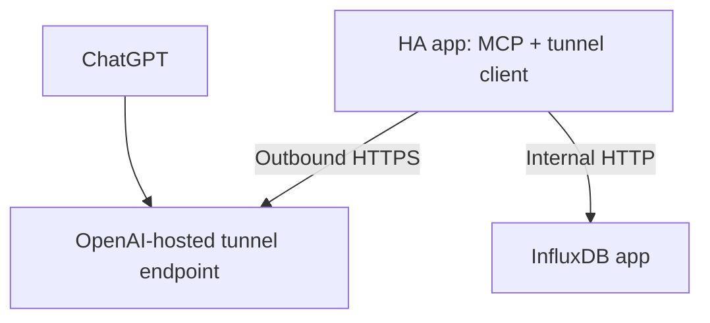

# Home Assistant InfluxDB MCP

A read-only MCP server packaged as a Home Assistant OS app (formerly add-on). It lets ChatGPT query Home Assistant history stored in InfluxDB without exposing InfluxDB—or any inbound port—to the internet.



The app embeds OpenAI's official Secure MCP Tunnel client and the MCP server in one Go process. The database interface is deliberately constrained: there is no raw InfluxQL tool, every history query has a bounded time range and point cap, and the supplied InfluxDB account should have `READ` permission only.

## Install

### From this repository after publishing it on GitHub

1. Push this tree to a GitHub repository.
2. In Home Assistant, open **Settings → Apps → App store → Repositories**.
3. Add the GitHub repository URL.
4. Install **Home Assistant InfluxDB MCP**.

### As a local app

Copy the `influxdb_mcp` directory into `/addons/influxdb_mcp` on Home Assistant OS, reload the app store, and install it from **Local apps**.

The full setup—including the read-only InfluxDB user and Secure MCP Tunnel—is in [influxdb_mcp/DOCS.md](influxdb_mcp/DOCS.md).

## MCP tools

| Tool | Scope |
| --- | --- |
| `list_measurements` | Measurement discovery |
| `list_entities` | Home Assistant entity and measurement discovery |
| `list_fields` | Field and type discovery |
| `get_latest` | Latest value for one entity |
| `query_entity` | Bounded raw or aggregated history |
| `query_entities` | Same-range comparison of several entities |

All six tools advertise the MCP `readOnlyHint`, `destructiveHint: false`, and `openWorldHint: false` annotations.

## Development

Requirements: Go 1.27 and Python 3 with PyYAML for repository validation.

```bash
make test
make build
make validate
```

Run locally with environment variables instead of `/data/options.json`:

```bash
INFLUX_URL=http://127.0.0.1:8086 \
INFLUX_DATABASE=home_assistant \
INFLUX_USERNAME=chatgpt \
INFLUX_PASSWORD=secret \
OPTIONS_PATH=/nonexistent \
go run ./influxdb_mcp/cmd/ha-influxdb-mcp
```

Then connect MCP Inspector to `http://127.0.0.1:8080/mcp` using Streamable HTTP.

## Test coverage

The automated suite verifies:

- Home Assistant option parsing and validation;
- InfluxDB v1 HTTP request/response behavior and error handling;
- InfluxQL escaping, time bounding, aggregation, limits, and fallback storage layouts;
- Home Assistant series-key parsing;
- all tool annotations and a full MCP initialize/list/call round trip over Streamable HTTP;
- health/readiness responses and secret non-disclosure;
- repository and app metadata consistency;
- Linux builds for both `amd64` and `arm64` in CI.

## Security model

- InfluxDB is reached only on the Home Assistant internal app network.
- Secure MCP Tunnel opens an outbound connection to OpenAI; no router port forwarding is needed.
- Tunnel and InfluxDB secrets are read from Home Assistant options and never returned by status endpoints or logged.
- The optional local MCP port is unmapped by default and is intended only for trusted-LAN testing.
- The server cannot write to InfluxDB or Home Assistant.

See [SECURITY.md](SECURITY.md) before exposing or modifying the local HTTP endpoint.

## License

MIT
